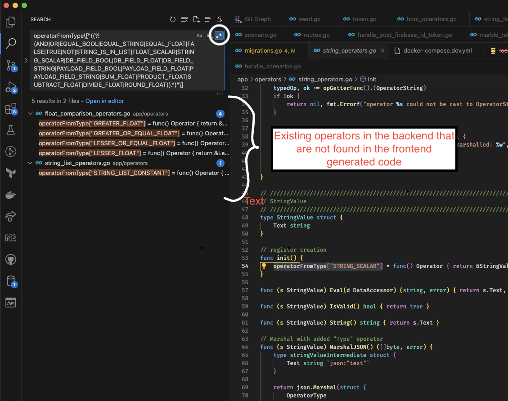

# marble-api

This package generates Marble API client based on `src/scripts/openapi.yaml`.

## Getting started

The generated code can be found in `src/lib/generated/marble-api.ts`

1. Make sure to have `scripts/openapi.yaml` up to date
2. Run `pnpm --filter marble-api run generate-api` to generate the client
3. Review generated code and commit changes

> NB: in case update introduced breaking changes, you may need to resolve TS issues in places the client is used

## Development

### Edit ECMAScript generation process

Change the generation script by editing `scripts/generate.ts`

### Expose some usefull helpers

Change or add files in `src/helpers`

> don't forget to explicitly expose public interface in `src/index.ts`

### Get updated regex to easilly find new operators in backend code

> May be deprcated soon with the new AST based approach

1. Run `pnpm --filter marble-api run operator-regex` to generate the regexp
2. Copy the regexp
3. Use the "Find All" VS Code tab from the backend

> NB: make sure to check the regexp box in the VS Code UI
