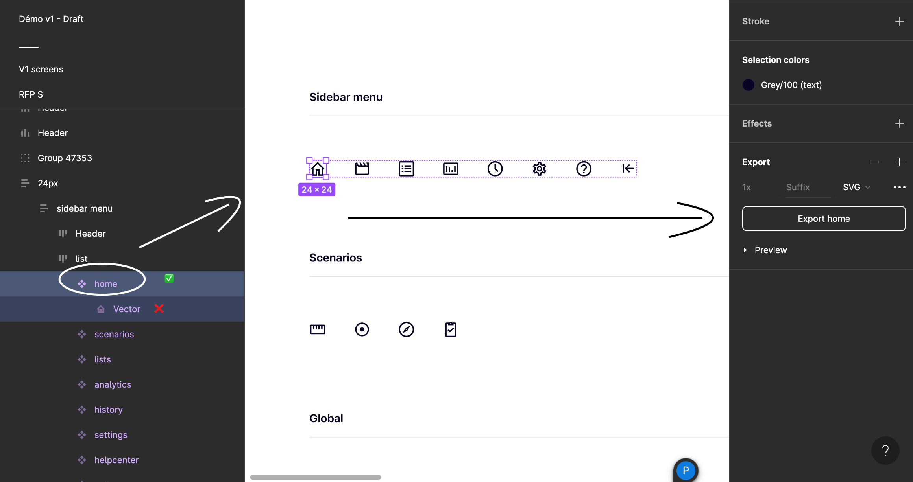

# @ui-icons

This package contains all the icons used in the UI. This generate svg sprites a React component for each svg icon.

We create two types of svg sprites:

- `icons-svg-sprite`: monocolored svg that can be colored
- `logo-svg-sprite`: multicolored svg that won't be colored

## Add a new asset

1. Get an svg export of your asset

> On Figma, ensure you select the Icon + Slice that make sense (= with the proper width & height) like in the above picture



2. Add the extracted svg in `/svgs`
   - if this is a new icon, add it in `/svgs/icons` (= monocolored svg that can be colored)
   - if this is a new logo, add it in `/svgs/logos` (= multicolored svg that won't be colored)

> Favour kebab-case file name & keep the exported name from Figma to make it easier to find already imported assets.

3. Run `pnpm --filter ui-icons run generate-icons`

4. Commit your changes

## Integration

### React

1. Install the package
2. Ensure svg sprites are bundled/loaded in your app
   2.1 Storybook bundled them automatically
   2.2 For Remix, you need to explicitly load them (look at `packages/app-builder/src/root.tsx` for an example)
3. Use the `Icon`/`Logo` component (depending on the type of svg sprite you want to use)

   ```tsx
   import { Icon } from 'ui-icons';

   const MyComponent = () => <Icon icon="plus" className="size-6" />;
   ```
